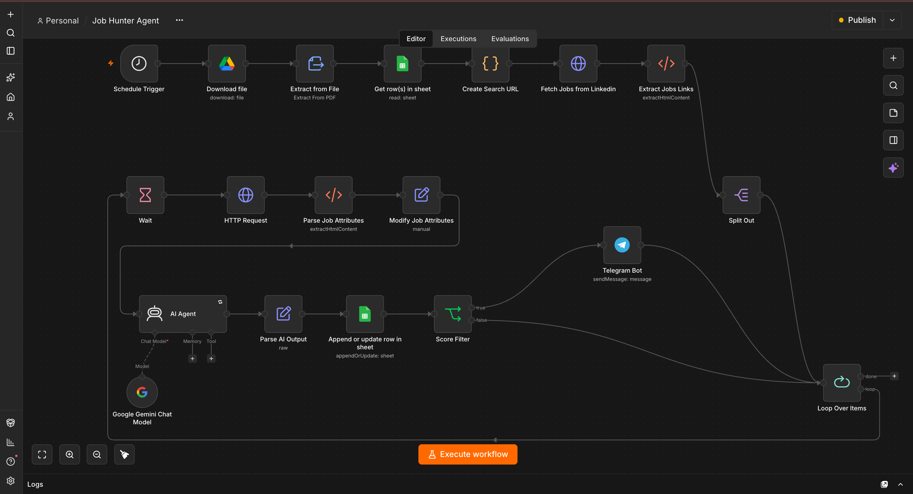
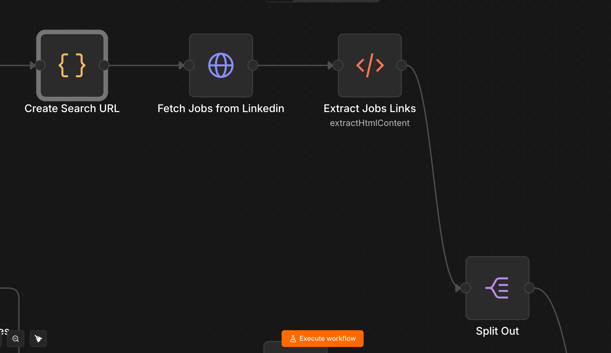
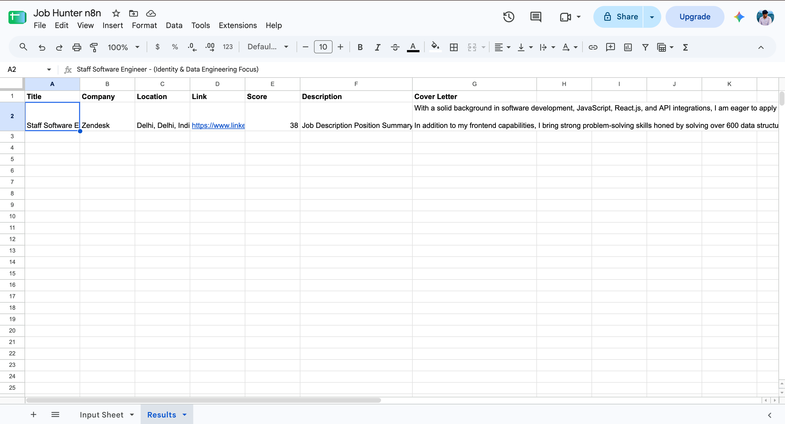
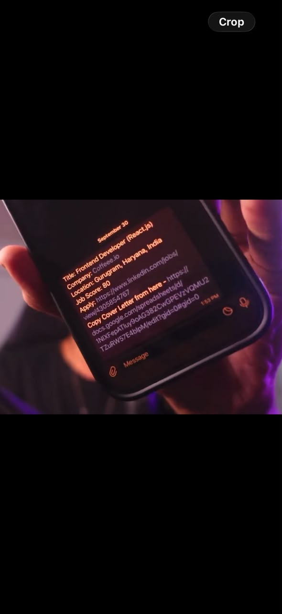

# 🤖 AI Job Hunter Agent

> An AI-powered job search and matching automation built with n8n, JavaScript, Google Gemini, Google Sheets, Google Drive, LinkedIn job search, and Telegram.

## 🎥 Demo

▶️ **YouTube Demo:** [Watch the complete project demonstration](https://youtu.be/vfTd2FFHlIE)

The video demonstrates the complete workflow from job discovery to AI matching, Google Sheets tracking, and Telegram notification.

---

## 📌 Overview

The AI Job Hunter Agent automates repetitive parts of the job-search process.

The workflow:

- Searches for jobs based on user-defined criteria
- Retrieves job-search results
- Extracts individual job links
- Extracts job details
- Compares job descriptions with the candidate's resume
- Uses Google Gemini to generate a matching score
- Generates a personalized cover letter
- Stores job information in Google Sheets
- Sends Telegram notifications for jobs meeting the configured score threshold

---

## ✨ Features

### 🔎 Automated Job Search

Search criteria are stored in Google Sheets and converted into a dynamic job-search URL.

Supported filters include:

- Keywords
- Location
- Experience Level
- Work Mode
- Job Type
- Easy Apply

### 📄 Resume Processing

The workflow downloads a PDF resume from Google Drive and extracts the resume text automatically.

### 🤖 AI Job Matching

Google Gemini analyzes:

```text
Resume
   +
Job Description
   ↓
AI Analysis
   ↓
Match Score
```

### ✍️ AI Cover Letter Generation

For each processed job, the AI generates a personalized cover letter based on the resume and job description.

### 📊 Job Tracking

Processed jobs are stored in Google Sheets with information such as:

- Job Title
- Company
- Location
- Job Link
- Description
- Match Score
- Cover Letter

### 📱 Telegram Notifications

Jobs meeting the configured score threshold are sent directly to Telegram.

---

## 🏗️ Architecture

```text
Schedule Trigger
       ↓
Google Drive
       ↓
Resume Extraction
       ↓
Google Sheets
(Search Preferences)
       ↓
JavaScript
(Search URL)
       ↓
LinkedIn Job Search
       ↓
Job Link Extraction
       ↓
Job Processing Loop
       ↓
Job Attribute Extraction
       ↓
Google Gemini AI Agent
       ↓
Match Score + Cover Letter
       ↓
Google Sheets
       ↓
Score Filter
       ↓
Telegram Notification
```

---

## 🔄 Workflow

The complete n8n workflow:

```text
Schedule Trigger
→ Download file
→ Extract from File
→ Get row(s) in sheet
→ Create Search URL
→ Fetch Jobs from LinkedIn
→ Extract Jobs Links
→ Split Out
→ Loop Over Items
→ Wait
→ Fetch Job Page
→ Parse Job Attributes
→ Modify Job Attributes
→ AI Agent
→ Parse AI Output
→ Append or update row in sheet
→ Score Filter
→ Telegram
```

Jobs that do not meet the score threshold continue through the loop and the next job is processed.

---

## 🖼️ Screenshots

### Workflow Overview



### Job Search



### AI Agent


### Google Sheets Results



### Telegram Notification



---

## 🤖 AI Agent

The AI Agent receives:

- Candidate resume text
- Job description

It produces structured output containing:

```json
{
  "score": 80,
  "coverLetter": "Personalized cover letter..."
}
```

The score is then used by the workflow to determine whether a Telegram notification should be sent.

---

## 🧠 Technologies Used

| Technology | Purpose |
|---|---|
| n8n | Workflow automation |
| JavaScript | Search URL generation and data transformation |
| Google Gemini | AI job matching and cover-letter generation |
| Google Drive | Resume storage |
| Google Sheets | Search criteria and job tracking |
| HTTP Request | Job-page retrieval |
| HTML Extraction | Job information extraction |
| Telegram | Job notifications |
| GitHub | Project documentation and version control |

---

## 📁 Repository Structure

```text
AI-Job-Hunter-Agent/
│
├── README.md
│
├── workflow/
│   └── job-hunter-agent.json
│
├── docs/
│   ├── setup.md
│   ├── workflow.md
│   ├── architecture.md
│   └── troubleshooting.md
│
├── screenshots/
│   ├── workflow-overview.png
│   ├── job-search.png
│   ├── ai-agent.png
│   ├── google-sheets-result.png
│   └── telegram-notification.png
│
└── prompts/
    └── job-matching-prompt.md
```

---

## ⚙️ Setup

### Requirements

- n8n
- Google account
- Google Drive
- Google Sheets
- Telegram
- Google Gemini API key
- Resume PDF

### Installation

1. Install or run an n8n instance.
2. Download or clone this repository.
3. Import `workflow/job-hunter-agent.json` into n8n.
4. Configure your Google Drive credential.
5. Configure your Google Sheets credential.
6. Configure your Google Gemini credential.
7. Configure your Telegram credential.
8. Update the Google Sheets document and search criteria.
9. Configure the Telegram Chat ID.
10. Test the workflow.

Detailed setup instructions are available in:

[Setup Guide](docs/setup.md)

---

## 📚 Documentation

- [Setup Guide](docs/setup.md)
- [Workflow Documentation](docs/workflow.md)
- [Architecture](docs/architecture.md)
- [Troubleshooting](docs/troubleshooting.md)
- [AI Matching Prompt](prompts/job-matching-prompt.md)

---

## 🔐 Security

This repository does **not** contain production credentials.

Do not commit:

- API keys
- Telegram bot tokens
- OAuth tokens
- Client secrets
- Passwords
- Resume files containing personal information
- Private Google Sheets data

Before publishing an exported n8n workflow, always inspect the exported JSON for sensitive values.

---

## ⚠️ Notes

This project is intended as an automation and portfolio project.

External websites can change their HTML structure, which may require updates to HTML selectors used by the workflow.

API availability, rate limits, and model availability may also change over time.

---

## 🚀 Future Improvements

Potential improvements include:

- Better job deduplication
- More advanced resume matching
- Additional job sources
- Automatic application tracking
- Interview tracking
- Email notifications
- Improved cover-letter customization
- Dashboard for job analytics
- More advanced AI ranking criteria

---

## 👨‍💻 Project

**AI Job Hunter Agent**

Built using:

`n8n` · `JavaScript` · `Google Gemini` · `Google Sheets` · `Google Drive` · `Telegram`
